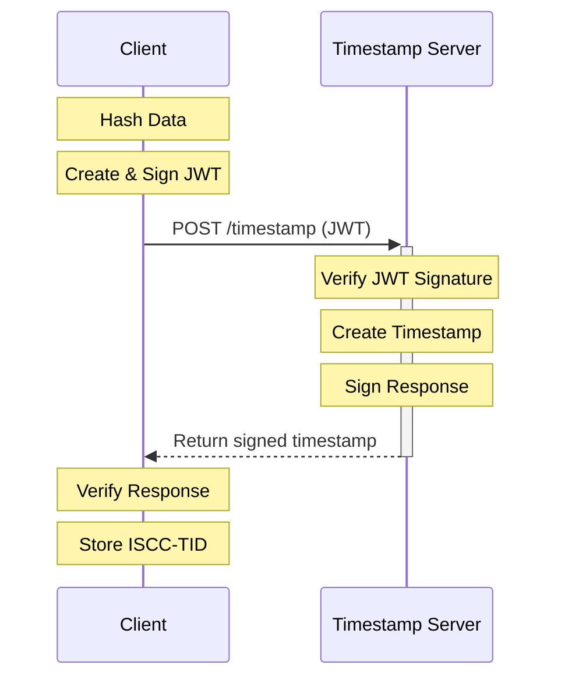

# ISCC Timestamping Protocol Specification v1.0

**Distributed, Globally Unique, and Owned Timestamps**

## 1. Overview

This specification defines a simple and scalable distributed timestamping protocol.

Clients may request timestamps to:

- Prove the existence of some data at time x
- Acquire provable ownership of a globally unique Identifier bound to the timestamped data

### 1.1 Protocol Features:

- Builds on top of JWS/JWT
- Time resolution: Dekamicroseconds (daµs): for 10 microseconds (1/100,000 second)
- Up to 4096 independent timestamp-servers
- Theoretical upper bound of 100.000 unique timestamps per seccond per server
- Scalable timestamping of large data
- Globaly unique timestamps accross servers
- Timestamps are identifiers owned by timestamp requesters
- Timestamp owners can cryptographically prove timestamp ownership
- Timestamps can be stored using 64-bit / 8-bytes
- Timestamps support total ordering accross servers
- Timestamps preserve order in numerical (integer) and lexical (base32hex) sorting

### 1.2 Protocol Flow



## ISCC-TID

An ISCC Time-ID (ISCC-TID) is constructed from the concatenation of:

- 1. The prefix `ISCC:`
- 2. The character `0` indicating the ISCC is base32hex encoded Time-ID
- 3. Base32hex encoded concatenation of:
  - a) 52-Bit integer timestamp (microseconds since epoch)
  - b) 12-Bit integer server-id

## Timestamp Request

Timestamping requests are JWT tokens using the following claim names:

- `ver`: Protocol version
- `iss`: Public key of the timestamp requester
- `sub`: Blake3 256-bit hash of data to be timestamped

Request are wrapped in the following JSON structure:

```json
{
    "type": "timestamp-request",
    "jwt": "<jwt-token>"
}
```

## Timestamp Response

Timestamp responses are JWT tokens using the following claim names:

- `ver`: Protocol version
- `jti`: ISCC-TID
- `iss`: Public key of the timestamp server
- `sub`: Blake3 256-bit hash the timestamped data
- `azp`: Public key of the timestamp reqester (owner of the ISCC-TID)

# NOTES

1. Transport Protocol:

- required transport protocol is https
- timestamp servers expose a single endpoint at the root or a custom path
- timestamp requests by clients use the HTTP POST method

2. Request/Response Format:

- Content type for requests/responses is application/json
- Request size must not exeed 1kb
- HTTP status codes to be defined

3. JWT Details:

- Version "1.0" of the protocol only supports alg EdDSA crv Ed25519
- Version "1.0" requires no headers outside off the standard JWT headers
- Claim formats/encodings:
  - ver: string exactly "1.0" for v1
  - iss: string hex encoded public key
  - sub: string hex encoded blake3 hash
  - jti: string See ISCC-TID spec
  - azp: string hex encoded public key
- Additional optional claims are not allowed

4. Validation Rules

- Requests must
  - have a valid signature verified against the public key of the requester (`iss`)
- Responses must
  - have a valid signature verified against the public key of the timestamp server (`iss`)
- Server should respond with an error it data is invalid
- Clients should dispose of invalid responses
- Timestamps must be microseconds since epoch
- Timestamp servers must issue monotonically increasing timestamps and handle clock synchronization
  by blocking until a timestamp higher than the last issued timestamp is available
- Timestamps signed by expired times-server key are invalid

5. Security:

- CORS policies should allow third party requests
- Keys are expired accoring to iscc-keys-format spec
- Replay attacks are handled by monotonic unique timestamp issuance?

6. Chaching

- responses should not be cacheable
- timestamps are valid indefinitely

7. Server Requirements

- A list of server IDs will be maintained on github
- If a server goes offline clients can use other servers from the server registry on github
- timeservers are required to use a trustworthy source of time
- Server must regularly synchronize their clock such that accuracy is ± 0.1 seconds
- Reference implementation is at https://github.com/iscc/iscc-crypto

______________________________________________________________________

## 2. Data Structures

### 2.1 ISCC-TID Format

- Prefix: "ISCC:"
- Version: "0"
- Payload: base32hex(timestamp\[52bits\] | server-id\[12bits\])

### 2.2 Request Format

```json
{
    "type": "timestamp-request",
    "jwt": "<jwt-token>"
}
```

Required JWT claims:

- ver: "1.0"
- iss: <hex-encoded-public-key>
- sub: <hex-encoded-blake3-hash>

### 2.3 Response Format

```json
{
    "type": "timestamp-response",
    "jwt": "<jwt-token>"
}
```

Required JWT claims:

- ver: "1.0"
- jti: <iscc-tid>
- iss: <hex-encoded-server-public-key>
- sub: <hex-encoded-blake3-hash>
- azp: <hex-encoded-requester-public-key>

## 3. Protocol Rules

### 3.1 Cryptographic Requirements

- EdDSA with Ed25519 curve only
- Blake3-256 for hashing
- No additional JWT headers allowed

### 3.2 Transport Requirements

- HTTPS only
- Single POST endpoint
- Content-Type: application/json
- Max request size: 1KB
- No caching
- CORS enabled

### 3.3 Server Requirements

- Monotonically increasing timestamps (microsecond precision)
- Clock sync within ±0.1s
- Server ID from official registry
- Valid server key according to iscc-keys-format

### 3.4 Validation Rules

- Request signature must verify against iss claim
- Response signature must verify against server public key
- Timestamps must be unique per server
- No duplicate timestamps for same data+requester combination
- Invalid requests/responses must be rejected

## 4. Security Considerations

- No sensitive data in requests/responses
- Public keys establish identity and ownership
- Replay protection via monotonic timestamps
- Server key rotation according to iscc-keys-format

```

Key simplifications and security principles:

1. Single signature algorithm (Ed25519) reduces complexity
2. Minimal JWT claims - only what's needed
3. Simple request/response format
4. Clear validation rules
5. No complex state management
6. Public data only - no secrets in protocol
7. Ownership proven through key possession
8. Built on standard primitives (JWT, EdDSA)
9. Clear server requirements
10. Explicit security boundaries

This structure provides a clear specification while keeping implementation complexity low and security requirements explicit but manageable.
```
